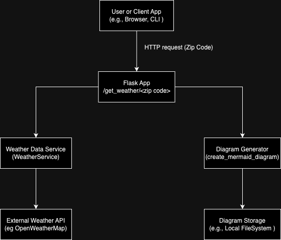

# weather_assignment

## Goal
To get weather according to zip code provided.

## Core Requirements
1. To expose an API server with one endpoint that will calculate and respond with the weather forecast for today in Fahrenheit 
2. Create a Graph Diagram programmatically which creates an HTML (output.html) with a [Mermaid JS].
3. Use GitHub Actions package to create a wheel file and test the weather_api code then publish the code coverage results as an HTML report
4. Interactive command line interface to 
   - run the API server
   - respond with the weather forecast for today
   - create the output.html diagram and optionally open it


## Additional Requirements
1. Maintainability (code organization and structure) User Experience
2. Data Validation
3. Security (API key management)
4. Documentation (End user and internal) Error handling
5. Testability
6. Python modern stack


## Architecture Diagram
</img>

Explanation of Each Component in the Diagram
1. User or Client App: The client sends a GET request with a ZIP code to the Flask app's /get_weather/<Zio_code> endpoint.
2. Flask App:
   1. Receives and validates the ZIP code.
   2. Calls the Weather Data Service (WeatherService) to retrieve weather information using an external weather API.
   3. If successful, the weather data is structured and passed to the Diagram Generator to create a visual repqresentation.
   4. Returns the JSON response containing path to generated diagram file and temperature in fahrenheit.
3. Weather data service 
   1. Calls the external API using the ZIP code to get the weather data
   2. Handles any errors from API and returns structred data back to the Flask app.
4. Diagram Generator:
   1. Receives structured weather data, processes it into a diagram (using MermaiJS) and saves the output to Diagram Storage.
5. Diagram Storage:
   1. Stores generated diagrams temporarily or permanently.
   2. Provides the file path to the Flask app to include in the response back to the user.


## Project Overview
This project provides a simple weather API service that:

- Retrieves weather information based on a provided ZIP code.
- Generates a visual diagram of the weather data using Mermaid diagrams.
- Includes unit tests for each module to ensure code accuracy and functionality.


## Project Structure


### Directory and File Descriptions


### `.github/workflows/`
- **build_test_publish.yml**: GitHub Actions workflow file for CI/CD automation.


### `diagram/`
- **create_diagram.py**: Module for generating Mermaid diagrams based on weather data.


### `tests/`
- **test_model.py**: Tests model functionality, ensuring data models validate and handle various input cases correctly.
- **test_utils.py**: Verifies utility functions in utils.py, such as temperature conversions and ZIP code validations.
- **test_create_diagram.py**: Tests create_diagram.py to ensure accurate diagram generation from weather data.
- **test_cli.py**: Checks command-line functionality in cli.py, verifying correct data retrieval and user interaction.
- **test_app.py**: Validates API endpoints in app.py, covering response accuracy, error handling, and integration of weather data and diagram generation.


### `weather_api/`
- **app.py**: Main application file, defines the Flask API endpoints, including the endpoint for retrieving weather data and generating diagrams based on ZIP codes.
- **model.py**: Contains data models and Pydantic schemas for weather data, ensuring data structure consistency and validation.
- **utils.py**: Utility module with helper functions, such as temperature conversion and handling interactions with external weather APIs.
- **cli.py**: Command-line interface for fetching and displaying weather data, enabling easy interaction with the API from the terminal.
- **create_diagram.py**: Generates visual diagrams of weather data using Mermaid, saving the output as an HTML file for easy access and visualization.


### Other Files
- **.gitignore**: Lists files and directories to be ignored by Git.
- **architecture_weather_api.png**: High-level architecture diagram for the project.
- **README.md**: Documentation for setting up and using the project.
- **requirements.txt**: Dependencies required for the project.
- **setup.py**: Script to package and distribute the project.


## Setup Instructions


1. Clone the repository:
```
git clone https://github.com/your-username/your-repo.git
cd your-repo
```

2. Create a virtual environment and activate it: </br>
In mac
```
python -m venv .venv
source .venv/bin/activate
```
In windows
```
python -m venv .venv
.venv\Scripts\activate
```
3. Install dependencies:
```
pip install -r requirements.txt
```
4. Set up environment variables:</br>
In Mac:</br>
create .env file
```
touch .env
```
Add environment variable OPENWEATHER_API_KEY
```
OPENWEATHER_API_KEY="your_api_key"
```

In Windows:
```
echo. > .env
notepad .env
OPENWEATHER_API_KEY="your_api_key"
```


5. Start server in first terminal</br>
In Mac:
```
gunicorn -w 4 -b 127.0.0.1:5002 weather_api.app:app
```

In Windows:
```
python -m flask run --host=127.0.0.1 --port=5002
```


6. Run python in second terminal</br>
Run the server
```
python weather_api/cli.py 30346
```

7. Running tests </br>
In Mac
```
PYTHONPATH=. pytest tests 
```


## Output
```
python weather_api/cli.py 30346
Weather data: {'current_temperature': 63.72, 'saved_file_path': 'output.html'}
Do you want to open the diagram in the browser? (yes/no): 
```
Type yes

</img>


